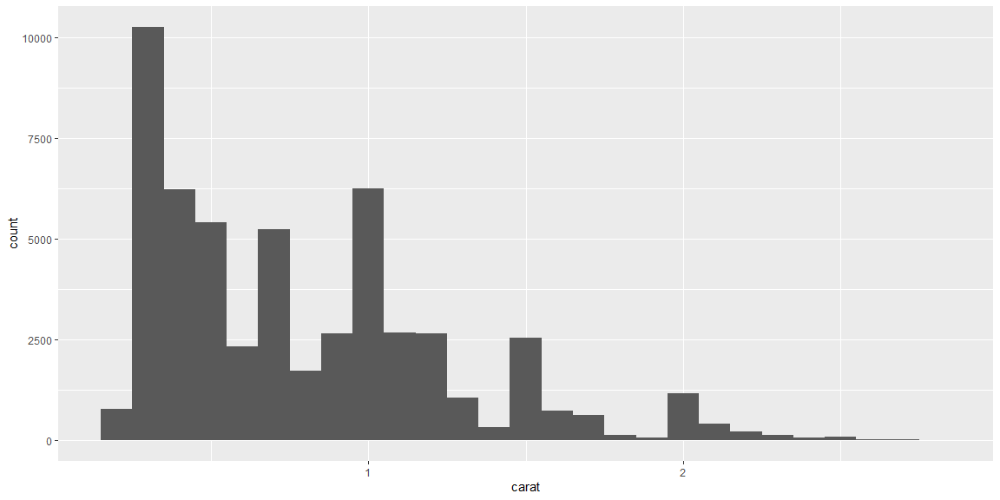
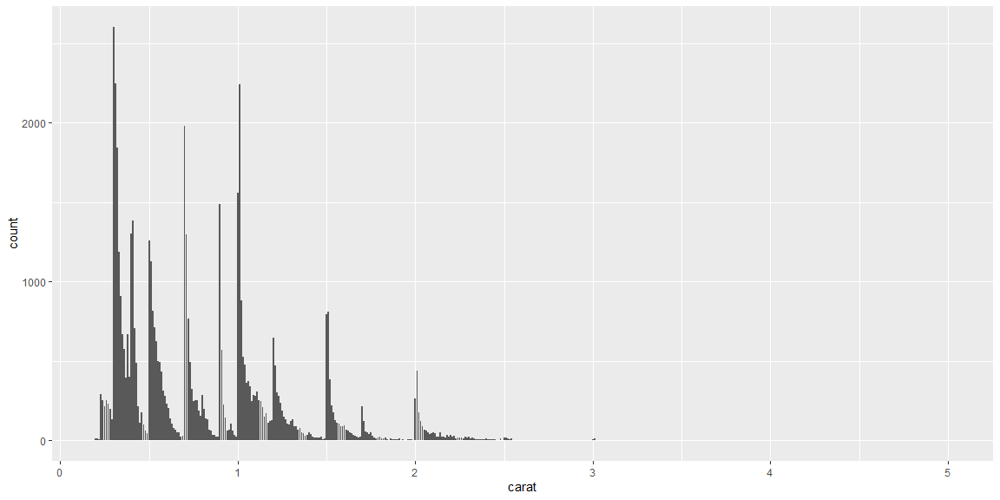

## Reading Notes

### EDA

#### Questions
 
- the right question with a near correct answer is better than the wrong question with a percise answer.
- What type of variation occurs within my variables
- What type of covariation occurs between my variables?

##### Variation
How much the  value changes from observation  to observation. You can find value in:
- Look for a pattern in the variation of the data.
- What calculations are most common and Why?
- Which values are rare? Why? Does that match your expectations?
- Can you see any unusual patterns? What might explain them?

You can group the data to find even more relations. 

##### Missing Values
Two solutions
- Remove Values
- Impute Vaules

##### CoVariation

A boxplot is a great way to see the covariance, the relationship between variables. 
- Reorder function
- Scattperplots

#### Patterns


## EDA Example

The code below is an example of the EDA process using the `starwars` data from the `tidyverse` package. (Make sure you have the `tidyverse` package installed!)

Run the code line-by-line and look at the output. Add a comment to each line of code that explains what it does/what insights it provides.


```r
library(tidyverse)
library(ggplot2)

dim(starwars)
```

```
## [1] 87 14
```

```r
colnames(starwars)
```

```
##  [1] "name"       "height"     "mass"       "hair_color" "skin_color"
##  [6] "eye_color"  "birth_year" "sex"        "gender"     "homeworld" 
## [11] "species"    "films"      "vehicles"   "starships"
```

```r
head(starwars)
```

```
## # A tibble: 6 x 14
##   name  height  mass hair_color skin_color eye_color birth_year sex   gender
##   <chr>  <int> <dbl> <chr>      <chr>      <chr>          <dbl> <chr> <chr> 
## 1 Luke~    172    77 blond      fair       blue            19   male  mascu~
## 2 C-3PO    167    75 <NA>       gold       yellow         112   none  mascu~
## 3 R2-D2     96    32 <NA>       white, bl~ red             33   none  mascu~
## 4 Dart~    202   136 none       white      yellow          41.9 male  mascu~
## 5 Leia~    150    49 brown      light      brown           19   fema~ femin~
## 6 Owen~    178   120 brown, gr~ light      blue            52   male  mascu~
## # ... with 5 more variables: homeworld <chr>, species <chr>, films <list>,
## #   vehicles <list>, starships <list>
```

```r
glimpse(starwars)
```

```
## Rows: 87
## Columns: 14
## $ name       <chr> "Luke Skywalker", "C-3PO", "R2-D2", "Darth Vader", "Leia...
## $ height     <int> 172, 167, 96, 202, 150, 178, 165, 97, 183, 182, 188, 180...
## $ mass       <dbl> 77.0, 75.0, 32.0, 136.0, 49.0, 120.0, 75.0, 32.0, 84.0, ...
## $ hair_color <chr> "blond", NA, NA, "none", "brown", "brown, grey", "brown"...
## $ skin_color <chr> "fair", "gold", "white, blue", "white", "light", "light"...
## $ eye_color  <chr> "blue", "yellow", "red", "yellow", "brown", "blue", "blu...
## $ birth_year <dbl> 19.0, 112.0, 33.0, 41.9, 19.0, 52.0, 47.0, NA, 24.0, 57....
## $ sex        <chr> "male", "none", "none", "male", "female", "male", "femal...
## $ gender     <chr> "masculine", "masculine", "masculine", "masculine", "fem...
## $ homeworld  <chr> "Tatooine", "Tatooine", "Naboo", "Tatooine", "Alderaan",...
## $ species    <chr> "Human", "Droid", "Droid", "Human", "Human", "Human", "H...
## $ films      <list> [<"The Empire Strikes Back", "Revenge of the Sith", "Re...
## $ vehicles   <list> [<"Snowspeeder", "Imperial Speeder Bike">, <>, <>, <>, ...
## $ starships  <list> [<"X-wing", "Imperial shuttle">, <>, <>, "TIE Advanced ...
```

```r
?starwars

starwars %>% count(species)
```

```
## # A tibble: 38 x 2
##    species       n
##    <chr>     <int>
##  1 Aleena        1
##  2 Besalisk      1
##  3 Cerean        1
##  4 Chagrian      1
##  5 Clawdite      1
##  6 Droid         6
##  7 Dug           1
##  8 Ewok          1
##  9 Geonosian     1
## 10 Gungan        3
## # ... with 28 more rows
```

```r
mean(starwars$height)
```

```
## [1] NA
```

```r
mean(starwars$height, na.rm = TRUE)
```

```
## [1] 174.358
```

```r
summary(starwars$height)
```

```
##    Min. 1st Qu.  Median    Mean 3rd Qu.    Max.    NA's 
##    66.0   167.0   180.0   174.4   191.0   264.0       6
```

```r
cm_to_ft <- function(cm){
  ft = cm / 30.48
  return(ft)
}

starwars_2 <- starwars %>% mutate(height_ft = cm_to_ft(height)) 

dim(starwars_2)
```

```
## [1] 87 15
```

```r
colnames(starwars_2)
```

```
##  [1] "name"       "height"     "mass"       "hair_color" "skin_color"
##  [6] "eye_color"  "birth_year" "sex"        "gender"     "homeworld" 
## [11] "species"    "films"      "vehicles"   "starships"  "height_ft"
```

```r
summary(starwars_2$height_ft)
```

```
##    Min. 1st Qu.  Median    Mean 3rd Qu.    Max.    NA's 
##   2.165   5.479   5.906   5.720   6.266   8.661       6
```

```r
ggplot(starwars_2, aes(height_ft)) + 
  geom_histogram()
```

```
## Warning: Removed 6 rows containing non-finite values (stat_bin).
```

<!-- -->

```r
starwars_2 %>% filter(height_ft == max(height_ft))
```

```
## # A tibble: 0 x 15
## # ... with 15 variables: name <chr>, height <int>, mass <dbl>,
## #   hair_color <chr>, skin_color <chr>, eye_color <chr>, birth_year <dbl>,
## #   sex <chr>, gender <chr>, homeworld <chr>, species <chr>, films <list>,
## #   vehicles <list>, starships <list>, height_ft <dbl>
```

```r
starwars_2 %>% filter(height_ft == max(height_ft, na.rm = TRUE))
```

```
## # A tibble: 1 x 15
##   name  height  mass hair_color skin_color eye_color birth_year sex   gender
##   <chr>  <int> <dbl> <chr>      <chr>      <chr>          <dbl> <chr> <chr> 
## 1 Yara~    264    NA none       white      yellow            NA male  mascu~
## # ... with 6 more variables: homeworld <chr>, species <chr>, films <list>,
## #   vehicles <list>, starships <list>, height_ft <dbl>
```

```r
# https://starwars.fandom.com/wiki/Yarael_Poof
```

## EDA Practice

Continue exploring the `starwars` data to gain additional insights, using [R4DS: Chapter 7](https://r4ds.had.co.nz/exploratory-data-analysis.html) as a guide.

It is ok if you don't understand the all code in Chapter 7. (That is what we'll be learning the next two weeks!) If writing your own code is a struggle, try the "copy, paste, and tweak" method.


```r
smaller <- diamonds %>% 
  filter(carat < 3)
  
ggplot(data = smaller, mapping = aes(x = carat)) +
  geom_histogram(binwidth = 0.1)
```

<!-- -->


```r
glimpse(diamonds)
```

```
## Rows: 53,940
## Columns: 10
## $ carat   <dbl> 0.23, 0.21, 0.23, 0.29, 0.31, 0.24, 0.24, 0.26, 0.22, 0.23,...
## $ cut     <ord> Ideal, Premium, Good, Premium, Good, Very Good, Very Good, ...
## $ color   <ord> E, E, E, I, J, J, I, H, E, H, J, J, F, J, E, E, I, J, J, J,...
## $ clarity <ord> SI2, SI1, VS1, VS2, SI2, VVS2, VVS1, SI1, VS2, VS1, SI1, VS...
## $ depth   <dbl> 61.5, 59.8, 56.9, 62.4, 63.3, 62.8, 62.3, 61.9, 65.1, 59.4,...
## $ table   <dbl> 55, 61, 65, 58, 58, 57, 57, 55, 61, 61, 55, 56, 61, 54, 62,...
## $ price   <int> 326, 326, 327, 334, 335, 336, 336, 337, 337, 338, 339, 340,...
## $ x       <dbl> 3.95, 3.89, 4.05, 4.20, 4.34, 3.94, 3.95, 4.07, 3.87, 4.00,...
## $ y       <dbl> 3.98, 3.84, 4.07, 4.23, 4.35, 3.96, 3.98, 4.11, 3.78, 4.05,...
## $ z       <dbl> 2.43, 2.31, 2.31, 2.63, 2.75, 2.48, 2.47, 2.53, 2.49, 2.39,...
```

```r
ggplot(data=diamonds)+
  geom_bar(mapping = aes(x=carat, y=))
```

<!-- -->
