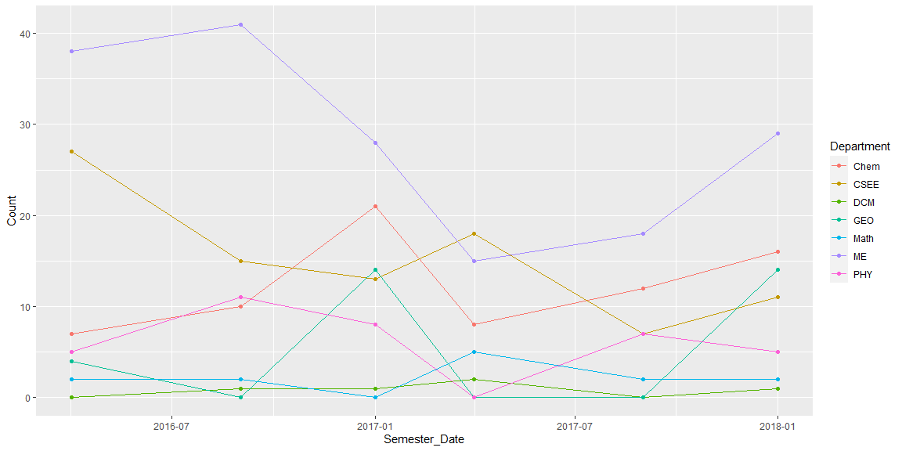

# What is wrong with this Graph?


```r
library(readr)
library(ggplot2)

rcw <- read_csv("https://byuistats.github.io/M335/data/rcw.csv", 
                col_types = cols(Semester_Date = col_date(format = "%m/%d/%y"), 
                                 Semester = col_factor(levels = c("Winter", "Spring", "Fall"))))
head(rcw)
```

```
## # A tibble: 6 x 5
##    Year Semester Semester_Date Count Department
##   <dbl> <fct>    <date>        <dbl> <chr>     
## 1  2016 Spring   2016-04-01        7 Chem      
## 2  2016 Fall     2016-09-01       10 Chem      
## 3  2017 Winter   2017-01-01       21 Chem      
## 4  2017 Spring   2017-04-01        8 Chem      
## 5  2017 Fall     2017-09-01       12 Chem      
## 6  2018 Winter   2018-01-01       16 Chem
```

```r
ggplot(data = rcw, 
       mapping = aes(x = Semester_Date, 
                     y = Count, 
                     color = Department)) +
  geom_line() +
  geom_point()
```

<!-- -->

