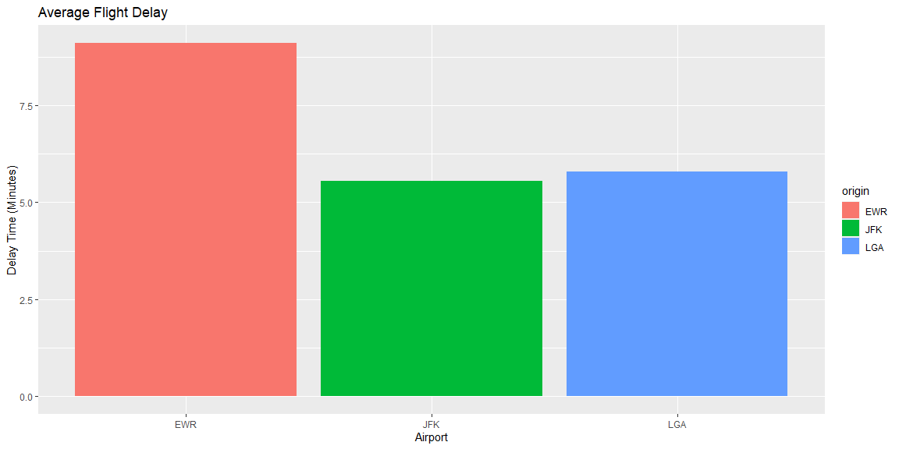
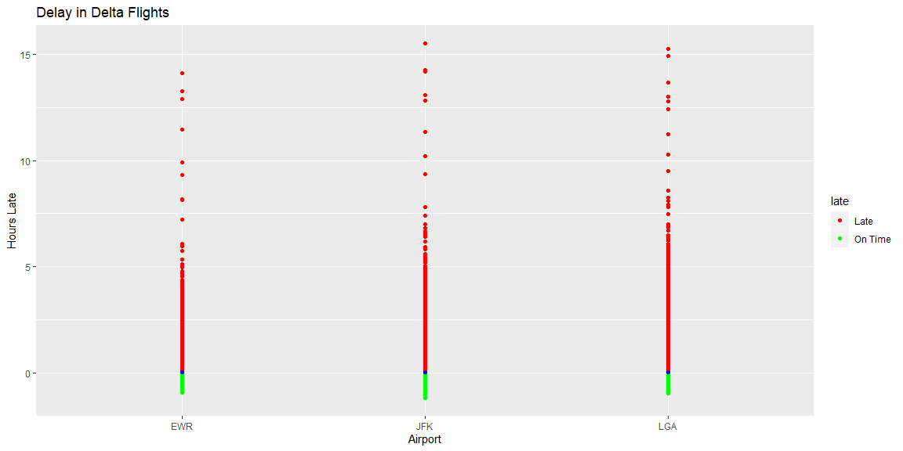

# Introduction

Going over the data I was able to find the answers to some of the questions. In my first metric I decided to use a summary to describe the data. I looked at the average arrival delay for each one of the airports. According to the data it looks like Newark Liberty International Airport (EWR) comes in last. Next I filtered the data into just delta airlines to see which airport has the least amount of late arrivals. I created an late column, and then made the individual observation. 

## Which destination airport is the worst airport for arrival time? (you decide on the metric for "worst").

<!-- -->

If we look at the graph we can see that the Newark Liberty International Airport (EWR) has on average the longest delay in arrival time. 

## Which origin airport is best to minimize my chances of a late arrival when I am using Delta Airlines?

<!-- -->

After seeing the graph it looks like for delta flights Newark Liberty International Airport (EWR) has the least amount of late flights. 
