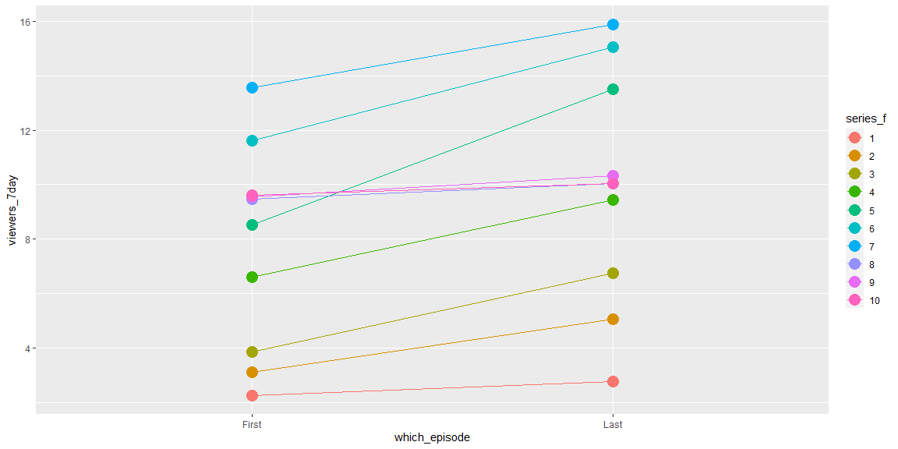

# Tasks

## Doing Reading (Chapter 5 Data Manipulation Notes)

Tibbles are the same thing as a dataframe, but better for r.

Data Types:

- int (integers)
- dbl (decimals)
- chr (characters)
- dttm (date time)
- fct (factor)
- lgl (logical)
- date (date)

All verbs works similarly:

newdataframe <- verb(dataframe, arguement)

### Filter

Use the near operation to do arthemtic comparisons because of infinite decimals. 

near() > ==

Boolean operators:

- & (and)
- | (or)
- ! (not)

Don't use  && or || that is used in conditional execution.

if NA is used in a boolean operation it will make the result a NA. 

NA == NA yields NA.  Use isna() for identifying missing values.

filter removes NA values.

### arrange

use desc() to order in descending order 

verb(dataframe,desc(argument))

NA is at the end

### select

helper functions:

- starts_with()
- ends_with()
- contains()
- matches()
- num_range()

use rename to rename columns instead of select.

rename(dataset, column_name = new_column_name)

everything() selects the entire dataset or the "rest" of it when using a select to reorder

### mutate

mutate adds columns at the end of a dataset.

mutate(dataframe, new_column = calculated_field )

transmute creates a new dataset using only the new columns

arithmetic operators:

- +,-,*,/,^,sum(), mean()
- modular %% 1/3 = 2
- log()
- lead() and lag() varibles in front or behind a certain index.
- Cumulative arithmitic.cumsum() and cummean() etc...
-  logical expresions > == < ect...
-  ranking min_rank() max_rank() use desc() to flip order

### summarise

Using group_by() and %>% 


## Charts


```r
library(bakeoff)
library(tidyverse)
```

## My improvements


```r
only_first_last <- ratings %>% # Reads in ratings and future dataframe into a variable called only_first_last
 group_by(series) %>% #Group_by Series creating a new dataframe
 slice(1, n()) %>% #selects the first and the last in each series. 
 mutate(which_episode = ifelse(episode == 1, "First", "Last")) %>% # Creates a new column called which_episode that decides if the row is either the first or the  last in the new column
 ungroup() %>%  # then ungroups the data from series.
 mutate(series_f = as.factor(series)) # Creates a new column that makes the series column a factor. exact same as first column.
View(only_first_last) # Views table


ggplot(data = only_first_last, # creates a plot for the data. Then maps x and y values and groups by the new column series_f and colors it.  It then makes an overlay of  a line and box plot
 mapping = aes(x = which_episode,
 y = viewers_7day,
 group = series_f,
 color = series_f)) +
 geom_line() +
 geom_point(size = 5)
```

<!-- -->


### My Graph


```r
glimpse(group_by(ratings,series))
```

```
## Rows: 94
## Columns: 9
## Groups: series [10]
## $ series               <fct> 1, 1, 1, 1, 1, 1, 2, 2, 2, 2, 2, 2, 2, 2, 3, 3...
## $ episode              <fct> 1, 2, 3, 4, 5, 6, 1, 2, 3, 4, 5, 6, 7, 8, 1, 2...
## $ uk_airdate           <date> 2010-08-17, 2010-08-24, 2010-08-31, 2010-09-0...
## $ viewers_7day         <dbl> 2.24, 3.00, 3.00, 2.60, 3.03, 2.75, 3.10, 3.53...
## $ viewers_28day        <dbl> 7, 3, 2, 4, 1, 1, 2, 2, 1, 1, 1, 1, 1, 1, 1, 1...
## $ network_rank         <int> NA, NA, NA, NA, NA, NA, NA, NA, NA, NA, NA, NA...
## $ channels_rank        <int> NA, NA, NA, NA, NA, NA, NA, NA, NA, NA, NA, NA...
## $ bbc_iplayer_requests <dbl> NA, NA, NA, NA, NA, NA, NA, NA, NA, NA, NA, NA...
## $ episode_count        <dbl> 1, 2, 3, 4, 5, 6, 7, 8, 9, 10, 11, 12, 13, 14,...
```

```r
ratings_10 <-  group_by(ratings,series) %>% 
  mutate(has10 = last(episode) == 10) %>%
  mutate(meany = mean(viewers_7day)) %>% 
  ungroup() %>% 
  mutate(cum_mean = cummean(viewers_7day)) %>% 
  filter(has10 == TRUE) %>% 
  group_by(series)
  
  

  


ggplot(ratings_10 ) +
  geom_line(mapping = aes(x = episode, y = viewers_7day, group = series, color = series, linetype = "Normal")) +
  geom_line(mapping = aes(x= episode, group = series, y = meany, color = series, linetype = "Mean")) + 
  labs(title = "The British Baking Viewer Ratings for Each Season", y= "Viewers in 7 days (millions)") +
  scale_linetype_manual("line", values = c("Mean" = 2,"Normal"= 1))+ 
  guides(fill = guide_legend(keywidth = 1, keyheight = 1),
    linetype=guide_legend(keywidth = 3, keyheight = 1),
    colour=guide_legend(keywidth = 3, keyheight = 1))
```

<!-- -->

