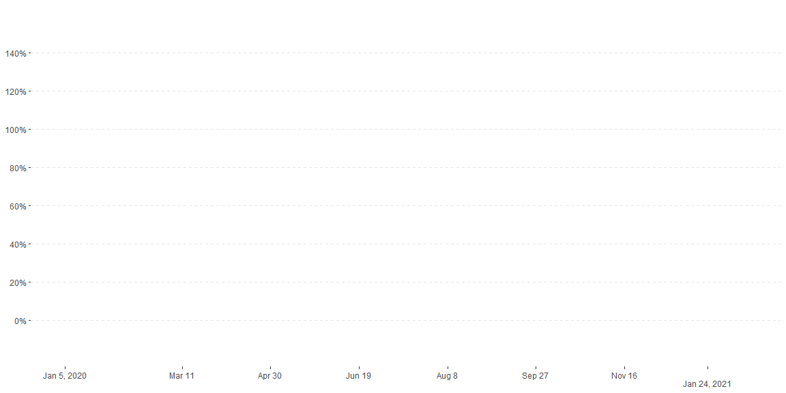
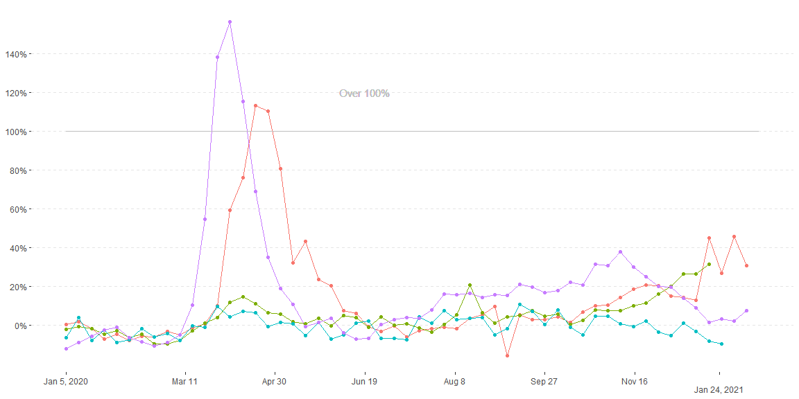
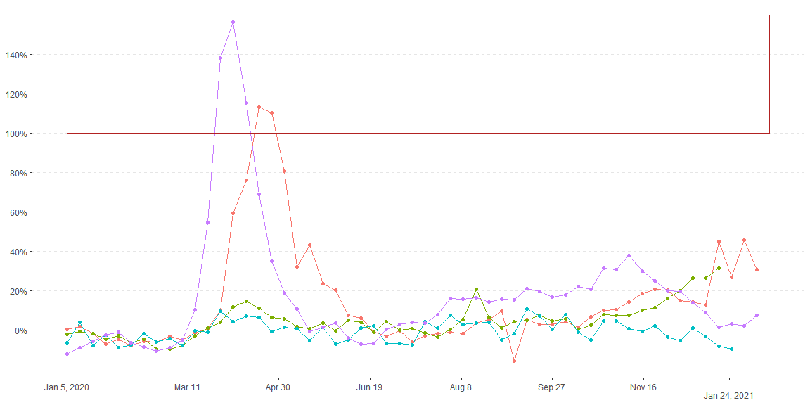
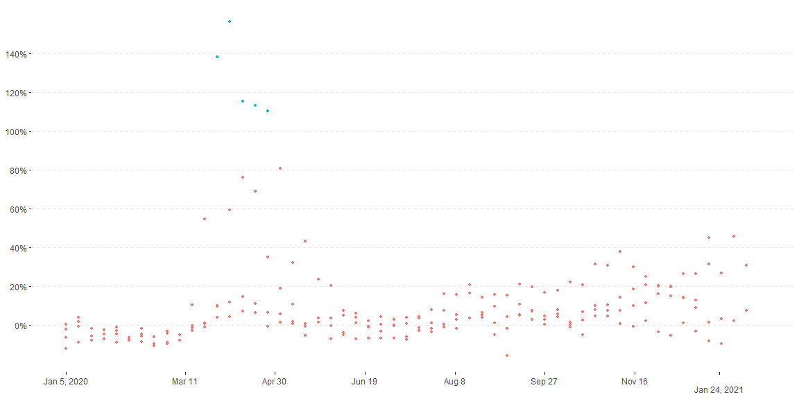
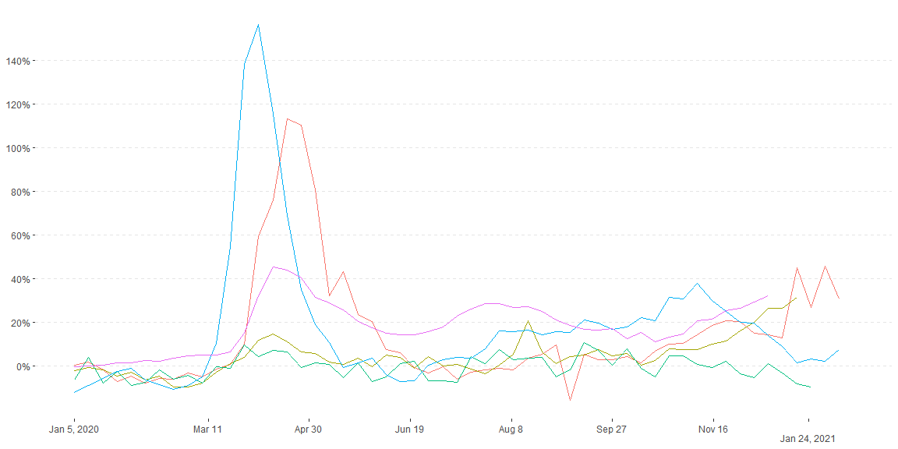
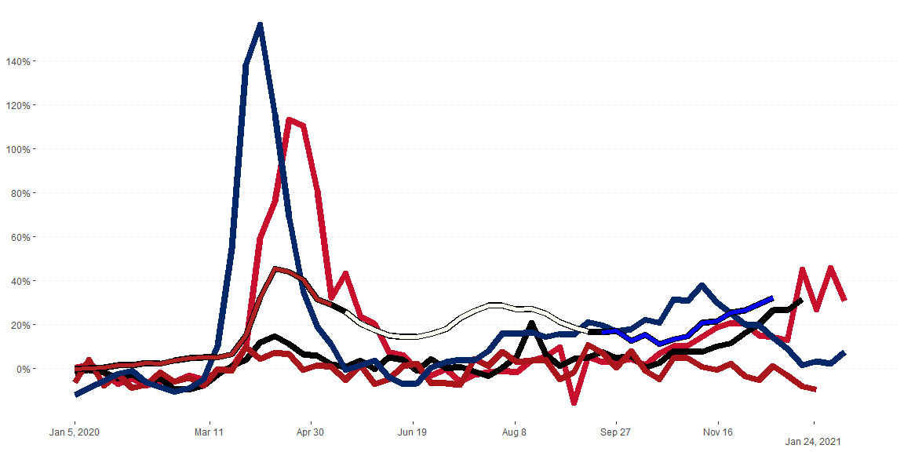
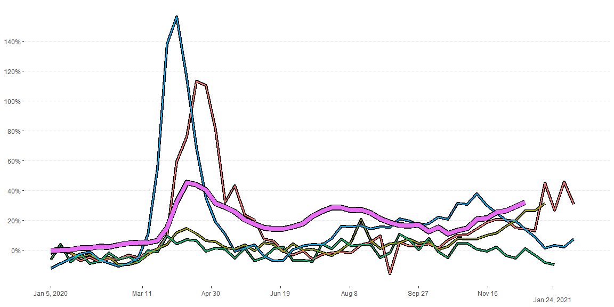

## Covid


```r
library(tidyverse)
library(scales)
covid <- read_csv("https://github.com/ktoutloud/classslides/raw/master/math335/data/M335_excess-mortality-p-scores.csv")


pivot_covid  <- transform(covid, date = as.Date(date)) %>% 
  mutate(Spain = Spain*100) %>% 
  pivot_longer(cols = -date,
               names_to = "country",
               values_to = "percents") %>% 
  as_tibble()

x_labs <- c("Jan 5, 2020","Mar 11","Apr 30","Jun 19","Aug 8","Sep 27","Nov 16","
Jan 24, 2021")
x_breaks <- as.Date(c("2020-01-05","2020-03-11","2020-04-30","2020-06-19","2020-08-08","2020-09-27","2020-11-16","2021-01-2"))


tidy_covid  <- pivot_covid %>% 
  filter(country %in% c("England...Wales","Germany", "Spain","Norway"), na.rm =TRUE) 
graph <- ggplot(tidy_covid,aes(x=date,y=percents/100, color=country))  +
  theme_bw() +
  scale_x_continuous(breaks = x_breaks, labels = x_labs) +
  scale_y_continuous(breaks = seq(0.00,1.40,.20), labels = percent) +
  theme(panel.grid = element_blank(),
        panel.grid.major.y = element_line("grey90",linetype = 2),
        panel.border = element_blank(),
        axis.title = element_blank(),
        legend.position = "none") 
  
graph
```

<!-- -->


## Highlight Plots


### Text

I like this method. It simple easy discriptive and not in the way, but its not very versatile because the text can't  move if its for a different set of data


```r
graph + 
  geom_line() +
  geom_point() +
  geom_line(mapping= aes(y=1.00),color="grey") +
  geom_text(x=as.Date("2020-06-19"),y = 1.20, label = "Over 100%", color="grey")
```

<!-- -->


### Fill

This is simple, but its kind of in the way. I don't like the look of it.  I couldn't get  the alpha to work on  this otherwise I feel like it would have been a better option.


```r
graph + 
  geom_line() +
  geom_point() +
  geom_rect(xmin=as.Date("2020-01-05"),
            xmax=as.Date("2021-01-24"),
            ymin=1,
            ymax=1.60,
            color = "firebrick",
            fill = NA,
            alpha = 0.2,
            linetype = 1)
```

<!-- -->

### Shapes

This one is by far the best value, but the only problem is the points don't stick out too much, so it could be missed by someone.


```r
graph + 
  geom_point(mapping = aes(x = date, y = percents/100,group = country, shape = percents > 100),size = 2) +
  geom_line()
```

<!-- -->


## US plots


```r
US_Covid <- filter(pivot_covid, country %in% c("England...Wales","Germany", "Spain","Norway", "United.States"),na.rm = TRUE) 


US_graph <- ggplot(US_Covid,aes(x = date,y = percents / 100, color = country))  +
  theme_bw() +
  scale_x_continuous(breaks = x_breaks, labels = x_labs) +
  scale_y_continuous(breaks = seq(0.00,1.40,.20), labels = percent) +
  theme(panel.grid = element_blank(),
        panel.grid.major.y = element_line("grey90",linetype = 2),
        panel.border = element_blank(),
        axis.title = element_blank(),
        legend.position = "none") 
  
  
US_graph + geom_line()
```

<!-- -->

### US Disctinct plots

This one was mostly for fun. I was sad that there was some black spots where there are null values, but I will take this. Its pretty close.  The other colors are suppose to be the other flags of the countries, but the colors are so simple that they are very similar.


#### Patriotic

```r
library(colorspace)

Merica <- filter(US_Covid,country == "United.States") %>% 
  mutate(colors = ceiling(seq(0.01,3,length.out = 56))) 
  

US_graph +
  geom_line(US_Covid, mapping = aes(x=date, y= percents/100, color = country), size = 3) +
  geom_path(Merica, mapping= aes(x=date,y=percents/100,color = as.factor(colors)),size =  2) +
  scale_color_manual(values=c("firebrick","#fffff4","blue","#c8102e","#000000","#aa151b","#002868","black"), aesthetics = "color")
```

<!-- -->

#### Bold

Sweet and simple. I like the pop on this, so it looks good. The US line just covers up the other data, and the res is low, so the border doesn't show up very well. 


```r
US_graph +
  geom_line(US_Covid, mapping = aes(x=date, y= percents/100, group = country), size = 2, color = "black") +
  geom_line(US_Covid, mapping = aes(x=date, y= percents/100, color = country), size = 1)   +
  geom_path(Merica, mapping= aes(x=date,y=percents/100),size =  4, color = 'black')+
  geom_path(Merica, mapping= aes(x=date,y=percents/100),size =  3) 
```

<!-- -->


